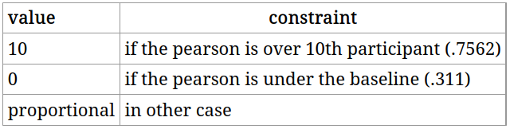

# Description of the Final Project (24-10-24)
## Comments from the Teacher
* 50% of the score
* SemEval 2012 Task  (Semantic Evaluation)
* Find phrases that are the same and a metric of similarity
  * see the label table for reference (IHLT web)
* Our data includes 4 datsets
  * trial : includes the definition of the scores, a sample of 5 sentence pairs and the input and output formats. It is not needed, but it is useful for prototyping.
  * train : training data from paraphrasing data sets, input and output formats.
  * test : test data from paraphrasing data sets.
  * All system submissions : submissions of the participants.
  * No other source data is allowed.
* Authors suggested pearson correlation as an evaluation method
* **We can use Spacy, but not the vectors** because it is an internal word embeding, those are forbidden
* No pdf reporting just:
  * Jupyter notebook
  * Slides
* **Use linters**, some kind of formaters (Black Formaters could be enough the problem is it's automatic )
  * PEP 8
  * MyPy or typing
  * Use .py files to learn and make it better
* **Important:** Ask questions on other presentations
* Getting a 10 in results should be easy
* Getting a 10 on the whole project is **imposible** (suposedly)
* **We can't use the labels from the test set, just the train set**

## Mark:
ProjectGrade = 0.1  ∗ Code Effectiveness +
               0.05 * Code Readability and Efficiency +
               0.05 * Use of NLP Libraries and Resources +
               0.4  * Analysis and Representation of Results +
               0.2  * Results + 
               0.2  ∗ Oral Presentation

